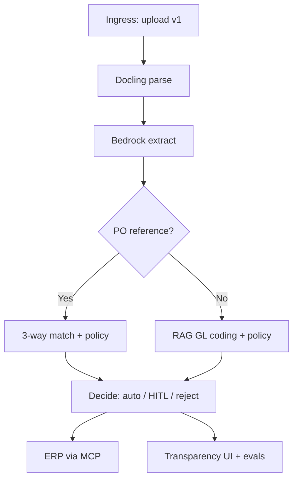

# Agentic AP Exception Handling Platform

Production-shaped **Accounts Payable exception automation**: ingest invoices, run
deterministic policy checks and AI-assisted extraction/GL coding, and post
approve/hold/flag decisions to ERP via MCP — with human-in-the-loop, a
transparency UI, and an evaluation harness that separates **measured results**
from **industry benchmarks**.

> **Status:** Platform complete through **Slice 14** (portfolio docs + eval gate).
> **Slice 15** — formal E2E verification on a clean deploy. v1 uses **swappable
> mock connectors** at ERP/notification edges; core pipeline is pilot-ready on
> real client PDFs via upload.

---

## Documentation (portfolio)

| Document | Contents |
|---|---|
| **[Architecture decision record (compiled)](docs/adr/ADR-001-system-architecture.md)** | Whole-build ADR — options, decision, measured outcomes |
| **[Post-build report](docs/post-build-report.md)** | Failures hardened during build (INC-001–026) |
| **[Business impact / ROI](docs/roi-framing.md)** | Measured vs industry benchmarks + modeled scenario |
| **[v2 integration roadmap](docs/v2-integration-roadmap.md)** | Email, webhook, bucket, real ERP, Slack |
| [`docs/incident-log.md`](docs/incident-log.md) | Append-only incident record |
| [`docs/adr/README.md`](docs/adr/README.md) | ADR index |

**Interview prompts:** *"Hardest architecture decision?"* → [ADR-001](docs/adr/ADR-001-system-architecture.md). *"Something that broke?"* → [post-build report](docs/post-build-report.md).

---

## Why this product exists

Enterprises automated AP intake; the **exception queue** is still manual work.

| Signal | Industry benchmark | Source |
|--------|-------------------|--------|
| Straight-through processing | **~35%** (2025 avg); best-in-class **~49%** | [Ardent *State of ePayables 2025*](https://www.bottomline.com/cdn/1517/5157/1685/Ardent%5FPartners%5F-%5FState%5Fof%5FePayables%5F2025%5F-%5FBottomline%5F-%5FFINAL.pdf) |
| Invoice processing time | **~8.2 days** (2025 avg) | Same |
| Exception resolution (elapsed) | **~4–5 days** median | [APQC](https://www.apqc.org/resources/benchmarking/open-standards-benchmarking/measures/cycle-time-days-resolve-invoice-error) |
| All-in cost per invoice | **~$9.84** | Ardent 2025 |

**This platform targets exception handling** — mismatches, missing GRNs,
duplicates, non-PO spend, ambiguous vendors — with defense in depth, durable
audit trails, and eval gates so quality is provable before scale.

**Tenants:** `manufacturing` (PO-heavy) and `retail_non_po` (non-PO emphasis).

---

## Proven results (measured on this deployment)

### Eval harness — adversarial quality gate

| Metric | Result | Threshold |
|--------|--------|-----------|
| Policy adherence | **100%** (30/30 smoke modes) | ≥ 80% |
| Routing label consistency | **100%** (30/30) | ≥ 70% |

Live Bedrock sample (`make eval-live --smoke`, 2026-09-16): task **95%**, tools
**100%**, RAG **100%**, extraction **100%** (5 cases). Full scorecard:
`backend/evals/results.json`.

### Speed vs market (scoped comparison)

On persisted upload runs (`make roi-metrics`, 2026-09-18):

| | Industry | This platform |
|---|----------|---------------|
| Exception resolution (elapsed) | **~4 days** median (APQC) | **~10 s** automated path (touchless run) |
| Model cost per invoice | **~$9.84** all-in | **~$0.0007** inference (measured) |

Comparison is for the **automation decision step** on auto-approved cases — not
full invoice-to-pay. Methodology and modeled annual impact:
[docs/roi-framing.md](docs/roi-framing.md).

---

## Architecture at a glance



**Boundary:** terminates at **approved for payment** — no payment execution
([ADR-011](docs/adr/ADR-011-no-payment-execution.md)). Full record:
[ADR-001](docs/adr/ADR-001-system-architecture.md).

| Layer | Choice |
|---|---|
| Orchestration | LangGraph supervisor graph |
| Model | Amazon Nova Lite via Bedrock Converse |
| Parsing | Docling (CPU) + conditional OCR |
| Rules | Deterministic policy engine (YAML per tenant) |
| Retrieval | Hybrid BM25 + pgvector, rerank, mandatory citations |
| Integrations | MCP — mock ERP + notification stub (v2: real connectors) |
| Evaluation | DeepEval + deterministic manifest gate |
| Observability | OpenTelemetry → Langfuse; KPIs with measured/benchmark legend |
| Frontend | React — check ledger, extraction provenance, eval scorecards |

---

## Design principles

1. **The harness is the reliability layer, not the model.**
2. **Deterministic where exact, probabilistic where judgment.**
3. **Best ≠ most** — exclusions documented in the specification.
4. **Fail loud** — no silent fallbacks.
5. **Defense in depth** — permissions at agent, policy, and MCP layers.

---

## Production stack (Docker)

```bash
cp .env.example .env          # CHECKPOINTER_BACKEND=postgres for durable HITL
make up-full                  # Postgres, mock ERP, API, UI, HITL lifecycle
make migrate                  # first time only
```

| Service | URL |
|---|---|
| UI | http://localhost:3000 |
| API | http://localhost:8080/health |
| Postgres | localhost:5432 |
| Mock ERP | http://localhost:8091/health |

---

## Quickstart (local dev)

```bash
cp .env.example .env
make install
make up && make migrate
make warm-models              # optional
make dataset-quick && make parse-demo
make check
```

| Service | URL |
|---|---|
| Postgres (+pgvector) | `localhost:5432` |
| Mock ERP | http://localhost:8091/health |

**API:** `make api` · **UI:** `make web-install && make web`

Live Bedrock uploads need AWS credentials in the API shell (never commit keys).

---

## Evaluations and business metrics

```bash
make eval          # deterministic CI gate → evals/results.json
make eval-live     # + Bedrock/DeepEval tiers (AWS in shell)
make roi-metrics   # latency percentiles + KPIs from Postgres
```

- **Manifest gate** — 30 adversarial failure modes; policy + routing consistency.
- **Per-upload judges** — async scoring after real document runs.
- **Business impact** — [roi-framing.md](docs/roi-framing.md) for benchmark comparison.

---

## Pilot readiness

| Ready now | v2 / pilot extension |
|-----------|---------------------|
| Real PDF/image upload + Bedrock extraction | Email, webhook, SFTP ingress |
| Tenant policy packs + MCP ERP contract | Production ERP connector |
| Durable HITL + Postgres audit trail | Customer SSO, multi-region |
| Eval gate + transparency UI | GitHub Actions CI for `make eval` |
| Measured KPIs (`make roi-metrics`) | Customer baseline time study for CFO sign-off |

---

## Specification

| Document | Contents |
|---|---|
| [Requirements](.kiro/specs/ap-exception-agent/requirements.md) | FR/NFR, success criteria §5 |
| [Design](.kiro/specs/ap-exception-agent/design.md) | Supervisor graph, streaming contract |
| [Tasks](.kiro/specs/ap-exception-agent/tasks.md) | Vertical slices 0–15 |
| [ADR-012](docs/adr/ADR-012-po-vs-non-po-routing.md) · [ADR-013](docs/adr/ADR-013-two-stage-extraction.md) · [ADR-014](docs/adr/ADR-014-live-evaluation-scoring.md) · [ADR-015](docs/adr/ADR-015-three-layer-permissions.md) | Detailed decisions |

---

## Success criteria ([requirements §5](.kiro/specs/ap-exception-agent/requirements.md))

| # | Criterion | Status |
|---|-----------|--------|
| 1 | Adversarial invoice processed E2E with live UI | Built — Slice 15 verification pending |
| 2 | Clean touchless path; exceptions escalate | Built |
| 3 | HITL + in-app; resume after decision | Built |
| 4 | Out-of-scope tool refused at agent + MCP | Built |
| 5 | DeepEval CI over adversarial dataset | Smoke gate live |
| 6 | Langfuse traces + UI KPIs | Built |
| 7 | Induced failure surfaces loudly | Built — Slice 15 demo pending |
| 8 | README, ADRs, post-build report | **Complete** |
