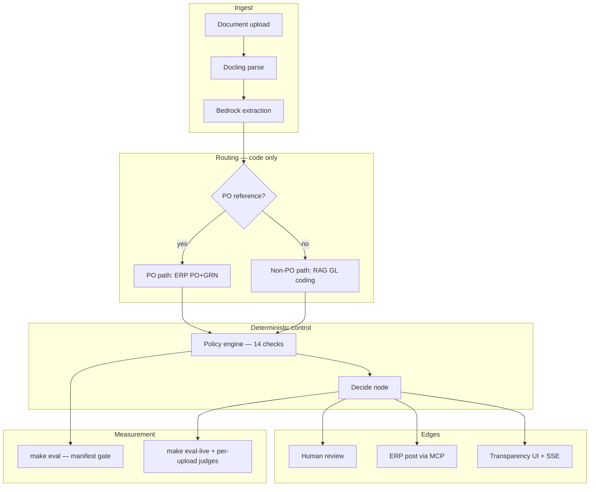

# ADR-001: Agentic AP exception layer — system architecture (compiled)

## Status

Accepted — portfolio synthesis compiled from implementation ADRs 008–015, the
specification, and measured build outcomes (Slices 0–13).

## Executive summary

We built a **production-shaped Accounts Payable exception automation platform** that ingests invoices (upload today; connector-swappable ingress in v2), runs deterministic policy checks, routes PO-backed and non-PO paths differently, and posts approve/hold/flag decisions to ERP via MCP — with human-in-the-loop, a transparency UI, and an evaluation harness that separates **measured deployment scores** from **cited industry benchmarks**. The architecture deliberately separates **exact work** (arithmetic, matching, permissions, routing) from **judgment work** (extraction, non-PO GL coding), and terminates at **approved for payment** — never payment execution.

This document is the **compiled architecture decision record** for the whole build. Detailed decisions remain in linked ADRs below; update this file when major architectural choices change (see [Revision history](#revision-history)).

---

## Situation

### What we were building

An agentic layer on top of existing AP operations:

1. **Ingest** PDFs/images and extract structured invoice data.
2. **Match** PO-backed spend against PO + goods receipt where applicable.
3. **Code** non-PO spend with grounded GL proposals and citations.
4. **Evaluate** fourteen deterministic policy checks per tenant pack.
5. **Decide** auto-approve, route for approval, hold, or reject.
6. **Observe** every step with spans, KPIs labelled measured vs benchmark,
   and a UI that streams check results in real time.
7. **Measure** quality on a synthetic adversarial dataset (CI gate) and on
   real uploaded documents (async Bedrock judges).

### Constraints that shaped every choice

| Constraint | Effect |
|------------|--------|
| Finance-adjacent domain | Auditability beats cleverness; no silent fallbacks |
| Pilot-ready core, swappable edges | Mock ERP/notifications in v1; MCP contract for production swap |
| No payment execution | Regulatory and trust boundary — decisions only |
| Multi-tenant demo | SQL-scoped isolation; policy packs per tenant |
| Eval as CI gate | Metrics must be reproducible and non-circular |
| AWS Bedrock for inference | Shell/profile credentials only — never committed |

### The core decision we had to make

**Where does the model decide, and where does code decide?**

If the model owns control flow, tolerances, or payment boundaries, the system
cannot be replayed, audited, or safely demonstrated to finance stakeholders.
If code owns everything, non-PO GL coding and messy document reading become
brittle rule engines. The build had to draw a defensible line.

---

## Options considered

We evaluated alternatives at **system level**. None was “free”; each traded
simplicity for a property we cared about.

### Option A — LLM-as-orchestrator (single agent, tools optional)

**Idea:** One large prompt + tool loop decides parse quality, PO vs non-PO,
matching outcome, GL code, and final route.

| Pros | Cons |
|------|------|
| Fastest to prototype | Control flow is non-deterministic and hard to audit |
| Fewer graph nodes | Tolerance and SoD logic buried in prompts |
| | Eval “pass” can mean “model agreed with itself” |
| | Incident-prone under adversarial invoices |

**Rejected** for a finance demo where replay and policy-as-code are requirements.

### Option B — Rules-only pipeline (no model on the decision path)

**Idea:** OCR + regex/templates + fixed rules; humans code all non-PO GL.

| Pros | Cons |
|------|------|
| Maximum determinism | Poor on layout variation and non-PO judgment |
| Easy to explain | Does not demonstrate modern agent value |
| | Extraction quality ceiling is low on scanned docs |

**Rejected** as the sole approach; retained as the **policy engine** half of the
final design.

### Option C — Single processing path for all invoices

**Idea:** Always run three-way match + always run RAG GL coding.

| Pros | Cons |
|------|------|
| One test matrix | Wastes RAG on PO-backed invoices with known GL |
| Simpler mental model | Matching on non-PO invoices is meaningless |
| | Eval scores conflate incompatible paths |

**Rejected** — see [ADR-012](ADR-012-po-vs-non-po-routing.md).

### Option D — Composite architecture (chosen)

**Idea:** LangGraph supervisor + deterministic policy engine + path-specific
AI work + three-layer permissions + layered evaluation.

| Pros | Cons |
|------|------|
| Auditable control flow | Two paths to build, test, and explain |
| Model only where judgment needed | Bedrock cost and credential ops |
| Clear eval split (PO vs non-PO) | Mock ERP hides real connector quirks |
| Defence in depth on writes | More moving parts than a demo script |

**Accepted** — details below and in linked ADRs.

### Supporting technology choices (summary)

| Area | Alternatives considered | Choice | Record |
|------|-------------------------|--------|--------|
| Vector store | Pinecone / dedicated vector DB | pgvector in Postgres | [ADR-008](ADR-008-pgvector-in-postgres.md) |
| Extraction | End-to-end multimodal only | Docling parse → Bedrock schema extract | [ADR-013](ADR-013-two-stage-extraction.md) |
| Payment boundary | Optional payment tool | Terminate at approved-for-payment | [ADR-011](ADR-011-no-payment-execution.md) |
| Permissions | Prompt-only guardrails | Agent RBAC + policy gate + MCP scopes | [ADR-015](ADR-015-three-layer-permissions.md) |
| Quality measurement | Single “accuracy” number | Deterministic CI + live DeepEval tiers | [ADR-014](ADR-014-live-evaluation-scoring.md) |

---

## Decision

### Architecture pillars

### 1. Orchestration — LangGraph supervisor

- **Extract → route → (optional GL code) → policy → decide** graph.
- Checkpointer-backed HITL interrupts; Postgres durability for reviews.
- Middleware: RBAC tool filtering, policy write gate, traced ERP client.

### 2. Routing — PO-backed vs non-PO ([ADR-012](ADR-012-po-vs-non-po-routing.md))

| Branch | Trigger | Matching | GL account | RAG eval |
|--------|---------|----------|------------|----------|
| PO-backed | `Invoice.is_non_po == false` | Three-way match | Inherited from PO | N/A |
| Non-PO | No PO reference on invoice | Skipped | Model + retrieval + faithfulness gate | Scored |

Routing is a **property of the extracted invoice**, never a model output.

### 3. Extraction — two stages ([ADR-013](ADR-013-two-stage-extraction.md))

- Docling: structure/OCR, provenance regions for UI highlight-back.
- Bedrock: schema-constrained `Invoice`; fail loud on type coercion failure.
- OCR escalates only when structural parse yield is implausibly low.

### 4. Policy — custom engine (policy-as-code)

- Fourteen named checks per tenant YAML pack (matching, fraud, identity, SoD).
- Verdicts: pass / fail / flag / skip — ledger persisted per run.
- Supervisor **decide** node reads ledger + gate; does not re-litigate rules in prompts.

### 5. Retrieval — hybrid RAG (non-PO only)

- BM25 + pgvector in Postgres ([ADR-008](ADR-008-pgvector-in-postgres.md)).
- Cross-encoder rerank; mandatory citations; faithfulness gate before auto-coding.

### 6. Permissions — three layers ([ADR-015](ADR-015-three-layer-permissions.md))

1. Agent RBAC — model cannot see disallowed tools.
2. Policy middleware — writes refused when ledger blocks payment.
3. MCP server scopes — ERP enforces tool contracts.

No payment tool exists ([ADR-011](ADR-011-no-payment-execution.md)).

### 7. Evaluation — three surfaces ([ADR-014](ADR-014-live-evaluation-scoring.md))

| Surface | Command / trigger | What it proves |
|---------|-------------------|----------------|
| Manifest CI gate | `make eval` | Policy adherence, routing label consistency (no label peek) |
| Live manifest sample | `make eval-live` | Bedrock extraction sample, DeepEval agent + RAG on small N |
| Per-upload async | Terminal live run | Five categories in UI + `run_evaluations` rows |

Headline rules: **minimum** of RAG triad and tool sub-scores — never average away a weak dimension.

### 8. Observability and UI

- OpenTelemetry → Langfuse; KPI dashboard + [ROI framing](../roi-framing.md) label **measured** vs **industry benchmark**.
- React UI: live check ledger, extraction provenance, eval scorecards.
- Run history and source pages read **Postgres**, not process memory (post INC-020).

### Measured outcomes (smoke + live + operational, 2026-09-18)

**Quality gate** — `backend/evals/results.json` after `make eval` and
`make eval-live --smoke`:

| Metric | Score | Gated in CI? |
|--------|-------|----------------|
| Policy adherence | 100% (30/30 smoke modes) | Yes |
| Routing label consistency | 100% (30/30) | Yes |
| Task completion (live DeepEval) | 95% (small sample) | No |
| Tool correctness (live) | 100% | No |
| Argument correctness (live) | 50% (2 agent cases) | No |
| RAG triad (live) | 100% | No |
| Extraction accuracy (live sample) | 100% (5 cases) | No |

**Speed vs market (scoped)** — `make roi-metrics` on persisted upload runs:
auto-approve path **~10.2 s** vs APQC exception-resolution median **~4 days**
(elapsed) and **~30 min** active-work midpoint. See [ROI framing](../roi-framing.md)
for comparison methodology and modeled annual impact.

Live tiers are **reported, not gated** — sample size and cost are explicit limitations.

---

## Consequences

### What we gained

- **Replayable control flow** for PO/matching/policy/decide — demonstrable to auditors.
- **Honest eval story** — circular metrics removed (INC-023); fabricated tool scores removed (INC-024).
- **Transparency UI** aligned with persisted truth — reload-safe (INC-020).
- **Clear v2 swap points** — MCP ERP and notification interfaces without pipeline rewrite.

### What we paid

- **Complexity:** Two invoice paths, three eval surfaces, three permission layers.
- **Operational:** Bedrock credentials in dev; `make eval-live` outside default `make check`.
- **Fidelity gap:** Mock ERP and synthetic dataset — not customer volume or real ERP edge cases.
- **Live eval variance:** Small agent sample (e.g. argument correctness 50% vs 75% run-to-run).

### Detailed decision records

| ADR | Topic |
|-----|--------|
| [ADR-008](ADR-008-pgvector-in-postgres.md) | Vectors in Postgres |
| [ADR-011](ADR-011-no-payment-execution.md) | No payment execution |
| [ADR-012](ADR-012-po-vs-non-po-routing.md) | PO vs non-PO routing |
| [ADR-013](ADR-013-two-stage-extraction.md) | Docling + Bedrock extraction |
| [ADR-014](ADR-014-live-evaluation-scoring.md) | Live eval scorecard |
| [ADR-015](ADR-015-three-layer-permissions.md) | Permissions |

---

## What we would revisit

With more time, production constraints, or customer data:

1. **Ingress** — email/webhook/SFTP adapters (v2 roadmap); today upload-only.
2. **Real ERP connector** — ADR on what mocks hid (rate limits, partial PO data, idempotency).
3. **Document taxonomy** — explicit `document_kind` for credit notes and negative flows instead of overloading non-PO routing.
4. **Eval scale** — gate argument correctness only after N≥30 live agent cases; wire GitHub Actions when cost model is acceptable.
5. **Vector scale** — revisit dedicated vector store if corpus exceeds comfortable Postgres size ([ADR-008](ADR-008-pgvector-in-postgres.md) threshold ~10M vectors).
6. **Cross-encoder startup** — rejected five-minute cold start for live eval; revisit managed rerank API or warm pool.
7. **Production deploy** — earlier deploy to catch persistence/reload bugs (INC-020 class) before UI polish.

---

## Revision history

| Date | Summary |
|------|---------|
| 2026-09-16 | Initial compiled ADR from ADRs 008–015, Slices 0–13 completion, `evals/results.json` smoke+live scorecard, and incident log through INC-026. |
| 2026-09-18 | Product positioning pass — benchmark comparison in measured outcomes; pilot-ready framing. |

### Future updates

When architecture changes materially, **append a dated subsection below** and add a row to the table above. Do not rewrite history — extend it.

#### 2026-09-16 — Initial publication

- Synthesized whole-build architecture for portfolio and README link.
- Anchored measured metrics to manifest smoke (30 modes) and live Bedrock sample (2 agent / 5 extraction cases).
- Cross-linked detailed ADRs and [post-build report](../post-build-report.md).

#### 2026-09-18 — Product positioning pass

- Reframed as production-shaped exception platform (pilot-ready core, swappable connectors).
- Added operational latency snapshot and industry benchmark comparison link in measured outcomes.

<!-- Template for next entry:
#### YYYY-MM-DD — Short title

- What changed architecturally.
- Which ADR(s) were added or superseded.
- New measured results if eval scorecard moved.
-->

---

## References

- [Requirements](../../.kiro/specs/ap-exception-agent/requirements.md) · [Design](../../.kiro/specs/ap-exception-agent/design.md) · [Tasks](../../.kiro/specs/ap-exception-agent/tasks.md)
- [Incident log](../incident-log.md) · [Post-build report](../post-build-report.md) · [ROI framing](../roi-framing.md) · [v2 roadmap](../v2-integration-roadmap.md)
- `backend/ap_agent/agent/supervisor.py` · `backend/ap_agent/policy/` · `backend/evals/`
