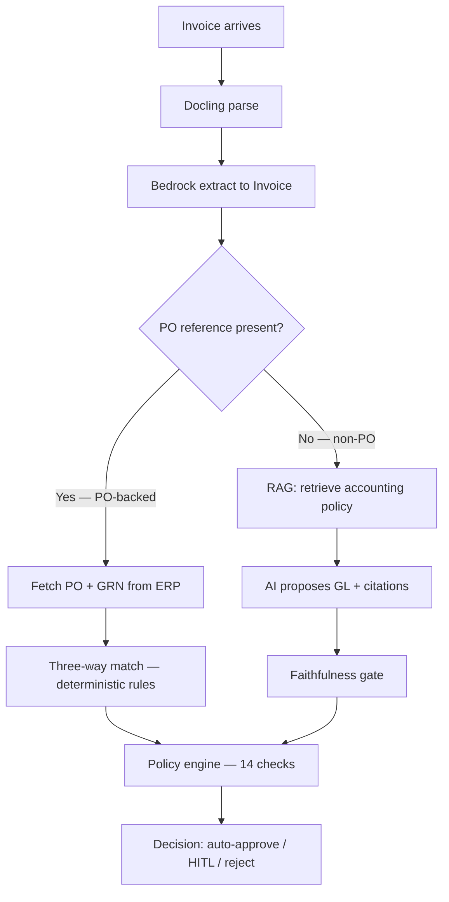

# ADR-012: PO-backed vs non-PO routing and GL coding

## Status
Accepted

## Context

Accounts Payable (AP) processes vendor invoices through four recurring steps:
verify the document, match it to what was ordered (when possible), assign a
**GL account** (general ledger — the expense category in the chart of accounts),
and route to auto-approve, human review, or reject.

**PO-backed invoice** — the invoice references a **Purchase Order (PO)**, a
pre-approved purchase. Finance performs **three-way matching**:

```
Invoice  ↔  Purchase Order  ↔  Goods Receipt (GRN)
```

When the match is clean, the GL account was already chosen when the PO was
created. No new coding judgment is required.

**Non-PO invoice** — no PO reference (utilities, one-off services, emergency
spend). There is nothing to match against. Finance must still pick the correct
GL account from company policy. Wrong coding affects financial reporting, budget
tracking, and audit compliance.

The system's central architectural claim is that **control flow must be
deterministic and replayable** — a model must not decide whether an invoice is
PO-backed or whether three-way matching applies. That is a fact about the
document (`Invoice.is_non_po`: no PO reference on the extracted invoice), not a
judgement call.

Related decisions: [ADR-013](ADR-013-two-stage-extraction.md) (how the invoice
is read), [ADR-014](ADR-014-live-evaluation-scoring.md) (how runs are scored by
path).

## Decision

After [extraction](ADR-013-two-stage-extraction.md), route on `Invoice.is_non_po`
— a pure property, never a model output:

| Branch | Matching | GL account | AI role |
|--------|----------|------------|---------|
| **PO-backed** | Three-way match against PO + GRN from ERP | **Inherited from PO** | Read document only |
| **Non-PO** | Matching checks skipped (not applicable) | **RAG + model proposal** with mandatory citations | Read document + propose grounded GL code |

Both branches then run the same **deterministic policy engine** (14 checks:
duplicate detection, tolerances, vendor validity, etc.) and a **pure decide
node** that maps ledger + gate + coding outcome to a terminal route.

Non-PO GL coding uses hybrid retrieval (BM25 + dense vectors, rerank, rail) over
tenant policy and precedent. A **faithfulness gate** enforces: no auto-coding
without a citation to a retrieved chunk and without clearing the tenant
confidence threshold. Ungrounded or low-confidence proposals route to HITL.

PO-backed invoices **never** enter the RAG coding path. Live eval marks RAG
grounding as not applicable for those runs ([ADR-014](ADR-014-live-evaluation-scoring.md)).

## Processing flow



### PO path — rules-first

| Step | Decided by |
|------|------------|
| Parse + extract | [ADR-013](ADR-013-two-stage-extraction.md) |
| PO vs non-PO | Code (`is_non_po`) |
| Match invoice ↔ PO ↔ receipt | Deterministic rules |
| GL account | Inherited from PO |
| Final route | Policy engine + decide node |

### Non-PO path — RAG for coding

| Step | Decided by |
|------|------------|
| Parse + extract | [ADR-013](ADR-013-two-stage-extraction.md) |
| Pick GL account | Model + RAG (retrieve policy, cite sources) |
| Trust the proposal? | Faithfulness gate |
| Final route | Policy engine + decide node |

Supervisor graph (implementation):

```
START → extract → route (is_non_po?)
                    ├─ non-PO → code_gl (RAG) ─┐
                    └─ PO-backed ──────────────┤
                                               ↓
                              policy → decide → END
```

## Consequences

- **Auditable control flow.** The PO/non-PO branch and matching logic replay
  byte-for-byte; only extraction and non-PO coding invoke the model.
- **Safer GL coding.** Non-PO auto-coding is structurally impossible without
  grounded citations; weak retrieval routes to humans.
- **Clear eval split.** Five-category live scorecard (task, tools, RAG, extraction,
  policy) — see [ADR-014](ADR-014-live-evaluation-scoring.md).
- **ERP contract.** PO-backed runs expect `erp.get_purchase_order` and
  `erp.get_goods_receipt`; non-PO runs skip those tools.
- **Scope honesty.** Credit notes and other edge cases that cannot forward-match
  a positive PO are treated like non-PO for matching purposes; dedicated
  `document_kind` detection is deferred.

## References

- `backend/ap_agent/core/canonical.py` — `Invoice.is_non_po`
- `backend/ap_agent/agent/supervisor.py` — supervisor graph and routing
- `backend/ap_agent/rag/coding.py` — RAG GL proposal and faithfulness gate
- [ADR-013](ADR-013-two-stage-extraction.md), [ADR-014](ADR-014-live-evaluation-scoring.md)
- FR-5.1 (PO vs non-PO routing), FR-5.2–5.4 and FR-6.6 (grounded GL coding)
