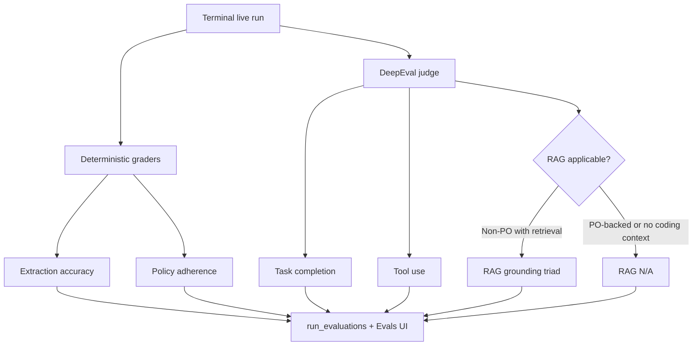
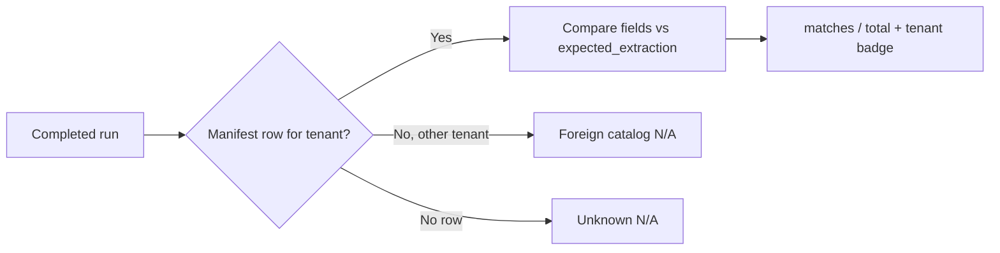
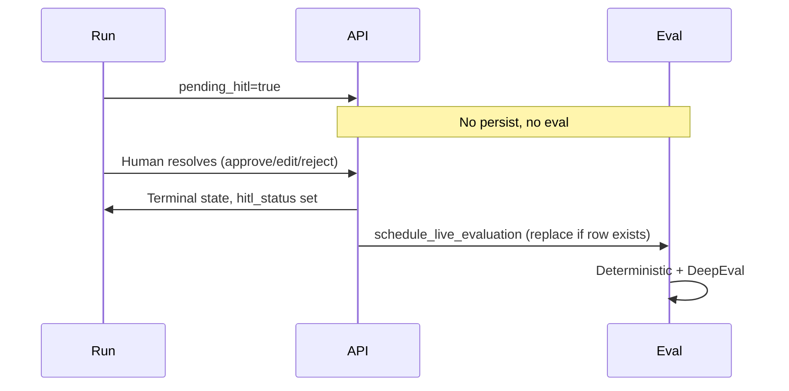

# ADR-014: Live evaluation scoring with DeepEval

## Status
Accepted

## Context

The system must measure quality on **real document runs**, not only synthetic
fixtures. Scores must be honest: no fabricated tool metrics on scripted demos,
and no averaging that hides a single unsafe dimension in RAG or tool use.

Finance-adjacent automation cares about **worst-case risk** — one unfaithful GL
proposal or one wrong ERP argument is enough to block trust, even if other
sub-scores look fine.

## Decision

Use **DeepEval** with a **Bedrock judge model** for agent-quality dimensions,
plus **deterministic graders** for extraction and policy on the Evals page.
Persist results in Postgres (`run_evaluations`) and expose them on the Evals UI
(`GET /evals`).

### Three evaluation surfaces

| Surface | Trigger | Purpose |
|---------|---------|---------|
| **`make eval`** | CI / local, deterministic manifest | Policy adherence, pipeline grading, extraction accuracy aggregate |
| **`make eval-live`** | CI with AWS credentials | Real Bedrock runs + DeepEval agent metrics on manifest sample |
| **Per-upload async** | After a live document run reaches a terminal state | Full scorecard → `run_evaluations` |

Scripted demo runs (`POST /runs` without upload) are **excluded** from per-upload
live eval — they have no real extraction process to judge.

### Five headline categories (per-upload)

| Category | Engine | Headline rule |
|----------|--------|---------------|
| **Task completion** | DeepEval `TaskCompletionMetric` | Single judge score |
| **Tool use** | `ToolCorrectnessMetric` + `ArgumentCorrectnessMetric` | `min(selection, arguments)` |
| **RAG grounding** | Faithfulness + answer + contextual relevancy | `min` of triad; **N/A** when no model-proposed GL coding |
| **Extraction accuracy** | Deterministic field compare vs manifest | `matches / total` header fields; **N/A** when run is not linked to a manifest case |
| **Policy adherence** | Deterministic ledger grade | Manifest: expected check verdicts vs actual ledger; otherwise applicable-check pass rate |

DeepEval categories use **minimum of components — never an average**. Rationale:
a strong average must not hide one unsafe dimension (e.g. 100% tool selection
with 0% argument correctness).

Deterministic categories use a single explicit ratio (field matches or check
matches) — there is no sub-score to min.

### Scoring by invoice path (DeepEval + RAG)

See [ADR-012](ADR-012-po-vs-non-po-routing.md) for routing context.

| Category | PO-backed | Non-PO |
|----------|-----------|--------|
| Task completion | Scored | Scored |
| Tool use | Expects PO + GRN + vendor + history tools | Expects vendor + history only |
| RAG grounding | **N/A** — GL inherited from PO | Scored when `coding_result` has `retrieval_context` |
| Extraction accuracy | Scored when manifest-linked | Same |
| Policy adherence | Scored on every completed run | Same |

### Extraction accuracy (deterministic)

> **One line:** We only grade extraction when we know the correct answers
> (manifest ground truth); for normal uploads we do not, so the UI shows **N/A**
> instead of a fabricated percentage.

Extraction accuracy asks: *did Bedrock recover the right header fields?* That
requires an **answer key** — `expected_extraction` on each row in
`datasets/generated/manifest.json` (invoice number, date, vendor, amounts, PO#,
etc.). The grader compares extracted values to that key using the same
`compare_extraction_fields` helper as CI (`evals/grading.py`).

#### Manifest mapping (when extraction is scored)

A run is **manifest-linked** when it resolves to a manifest row **for the same
tenant**. Lookup is tried in order (`manifest_entry_for_state`):

| Run field | Example | Matches when |
|-----------|---------|--------------|
| `invoice_id` | `clean_touchless-000` | Equals `case_id` and `tenant_id` matches |
| `document_id` | `doc-clean_touchless-000` | Strips `doc-` prefix; `case_id` + tenant match |
| `document_id` | `8594ff05…` (SHA-256) | `(tenant_id, content_sha256)` matches manifest row |

Dataset artefacts live under `datasets/generated/invoices/{tenant_id}/`. UI
uploads pick a tenant (`retail-demo` or `manufacturing-demo`); the ingress path
stores the file digest as `document_id`, so a dataset PDF uploaded under the
correct tenant scores without renaming.

When no row matches for the run tenant, extraction is **N/A** with
`ground_truth_status: unknown` and an **Unknown document** badge. When the bytes
exist in another tenant’s catalog, status is `foreign` — no score is fabricated.

### Policy adherence (deterministic)

- **Manifest-linked run:** compare each `expected_checks` verdict to the actual
  `CheckLedger` on the completed run state.
- **Other live runs:** `passed / applicable` where applicable checks exclude
  `skip` verdicts.

This is separate from DeepEval task completion, which judges holistic outcome
text; policy adherence measures the ledger directly.

### HITL lifecycle

`schedule_live_evaluation` runs only when:

- `live_evals_enabled` is true
- Run has a real invoice and `extraction_meta` (upload path)
- Run is **not** still `pending_hitl`
- No existing `run_evaluations` row — **unless** `hitl_status` is set after
  human resolution, in which case the prior row is replaced and the run is
  re-scored on the final outcome

Status flow: `pending` → `running` → `completed` | `failed` (error persisted).

### CI thresholds

`evals/thresholds.py` defines minimum scores for the manifest gate (e.g. task
completion ≥ 0.70, tool correctness ≥ 0.90, extraction accuracy ≥ 0.80). Live
tiers are skipped when AWS is unavailable rather than failing the deterministic
gate.

## Consequences

- **Full scorecard on Evals page.** Five categories with honest N/A when a dimension does not apply.
- **Conservative DeepEval headlines.** Reviewers see the weakest sub-score on judge dimensions.
- **Post-HITL fidelity.** Final human decisions are what get scored, not the pre-pause state.
- **Auditable trail.** `details` JSON retains judge reasons, tool actual/expected, extraction mismatches, and policy mismatches.
- **Schema migration required.** `extraction_accuracy` and `policy_adherence` columns on `run_evaluations`.

## References

- `backend/ap_agent/evaluation/live.py` — scheduling, DeepEval assembly
- `backend/ap_agent/evaluation/deterministic_scores.py` — extraction + policy graders
- `backend/ap_agent/evaluation/judge.py` — Bedrock judge model
- `backend/ap_agent/api/platform.py` — `GET /evals` payload
- `backend/evals/extraction_eval.py` — CI extraction aggregate
- `backend/evals/grading.py` — CI policy + field compare helpers
- `backend/evals/harness.py` — CI scorecard
- `backend/evals/thresholds.py` — CI gate thresholds
- FR-13.3, FR-13.6
