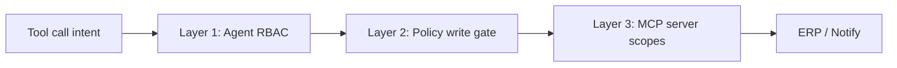

# ADR-015: Three-layer permissions and agent RBAC

## Status
Accepted

## Context

An AP agent that can read ERP data and post bill decisions is a high-trust
surface. Relying on prompt instructions (“do not post unless allowed”) is not
sufficient. A compromised agent process, a middleware bug, or a model that
hallucinates a tool call must still be unable to exceed least privilege.

The system also **never executes payments** — it terminates at “approved for
payment” ([ADR-011](ADR-011-no-payment-execution.md)). Permissions must reflect
that boundary: no payment scope, no payment tool.

## Decision

Enforce permissions at **three independent layers** (defence in depth, FR-9.2).
Each layer refuses over-privileged actions on its own — bypassing one does not
bypass the others.

### Layer 1 — Agent RBAC (toolset filtering)

**Where:** `RbacToolFilterMiddleware` in `wrap_model_call` — inside the agent.

**What:** Remove disallowed tools from the list **before the model is called**.
A permission the model cannot see is a permission it cannot invoke.

Tool groups (ceiling for the whole system):

| Group | Tools |
|-------|-------|
| **Read-only** | `parse_document`, `retrieve_policy`, `lookup_precedent`, `get_purchase_order`, `get_goods_receipt` |
| **Write** | `post_erp_action`, `notify_approver` |

Each sub-agent receives an allow-list (`READ_ONLY_TOOL_NAMES`, `WRITE_TOOL_NAMES`,
or subsets). The toolset is capped (`MAX_TOOLS`) — growing attack surface is
explicitly resisted.

**There is no payment tool in the toolset.**

### Layer 2 — Policy-engine middleware (write gate)

**Where:** `wrap_tool_call` on ERP write tools — in-process at the boundary.

**What:** Every `post_erp_action` runs through the **deterministic policy
engine** before the ERP is touched. Even a caller that holds the write tool is
refused when the ledger says the invoice is not payable (blocked vendor, control
account, already paid, etc.).

This is **rules**, not roles — but it is the second lock on writes.

### Layer 3 — MCP server-side scopes

**Where:** ERP and notification MCP server processes — outside the agent.

**What:** Each tool declares a required scope. The server checks the caller’s
**purpose-scoped token** in Python before executing — not via prompt text.

| Token | Granted scopes |
|-------|----------------|
| `erp-reader` | `erp:read` |
| `erp-writer` | `erp:read`, `erp:write` |
| `notifier` | `notify:send` |

Unknown or missing tokens grant **nothing** (fail closed). There is **no payment
scope** anywhere in `Scope`.

A read-only token calling a write tool raises `PermissionDenied` **server-side**,
even if Layer 1 RBAC were removed — this is the property integration tests assert.

### Purpose tokens, not user identity

The agent presents a **purpose token** (e.g. `erp-reader` for a read phase), not
the end user’s credentials (FR-9.3). Tokens are least-privilege and
purpose-scoped; there is no admin token.

## Consequences

- **Verifiable restrictions.** Static tests assert filtered toolsets and server-side denials.
- **Independent failure domains.** Agent bug ≠ automatic ERP write if policy or MCP refuses.
- **UI transparency.** `GET /guardrails` reports layers and `TOKEN_SCOPES` from live config.
- **Operational note.** In production, purpose tokens would be short-lived secrets minted by a broker; v1 uses stable identifiers whose **scope grant** is what matters for controls.

## References

- `backend/ap_agent/agent/middleware.py` — middleware stack order, RBAC filter
- `backend/ap_agent/agent/tools.py` — tool ceiling, `READ_ONLY_TOOL_NAMES`, `WRITE_TOOL_NAMES`
- `backend/ap_agent/mcp_servers/permissions.py` — `Scope`, `TOKEN_SCOPES`, `require_scope`
- `backend/ap_agent/api/platform.py` — `GET /guardrails`
- [ADR-011](ADR-011-no-payment-execution.md) — no payment execution
- FR-9.1–9.4
