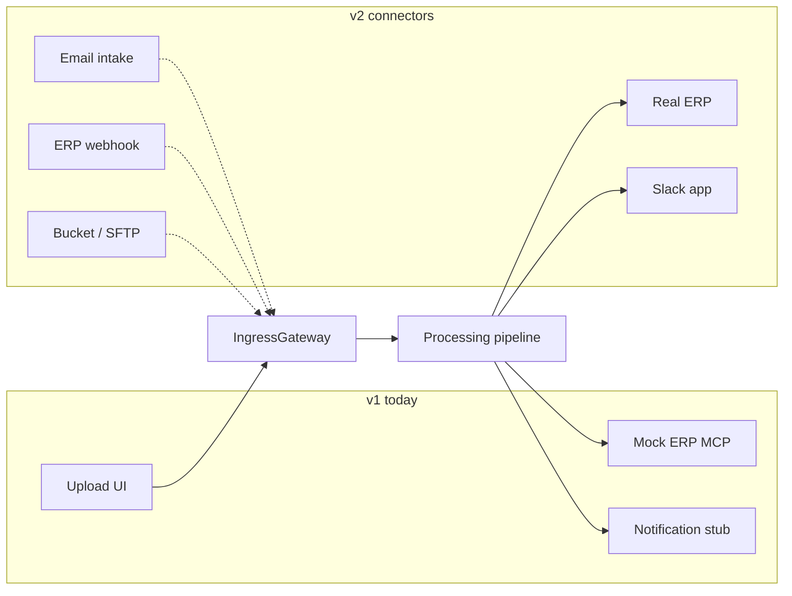

# v2 integration roadmap — connector swaps, not rewrites

v1 deliberately ships **mocks at the edges** and **real logic in the middle**.
v2 replaces ingress adapters and MCP connectors while keeping the supervisor
graph, policy engine, RAG rail, eval harness, and UI contract unchanged.

See [ADR-001](adr/ADR-001-system-architecture.md) for architecture context.
Update [revision history](#revision-history) when scope or interfaces change.

---

## Design rule

> **If v2 requires changing `supervisor.py` routing or `policy/engine.py` checks,
> the v1 interface was wrong — fix the interface in v1 first.**

Every v2 item below maps to an **existing protocol** already exercised in tests.

---

## System diagram (v1 → v2)

Dotted lines = stub adapters exist (`EmailIntakeAdapter`, `ErpWebhookAdapter`,
`BucketWatcherAdapter` in `backend/ap_agent/ingest/adapters.py`); they raise
`NotImplementedError` rather than silently dropping documents.

---

## Ingress (v2.1 – v2.3)

All paths normalize to **`InvoiceReceived`** before `IngressGateway` runs
validation, content-hash dedupe, and persistence (FR-1.2, FR-1.3).

| Task | Adapter | Source | v1 seam | v2 work |
|------|---------|--------|---------|---------|
| **v2.1** | `EmailIntakeAdapter` | AP mailbox forwarding (MIME + attachments) | `IngestionAdapter` protocol + `IngressGateway` | Parse MIME, virus-scan hook, map to `DocumentPayload`, yield events |
| **v2.2** | `ErpWebhookAdapter` | Customer ERP push (invoice created) | Same gateway | Verify webhook signature, map ERP JSON → `DocumentPayload` or fetch PDF by URL |
| **v2.3** | `BucketWatcherAdapter` | S3/GCS/SFTP drop | Same gateway | Poll or event-driven object created; optional rename-on-process |

**Pipeline changes:** none. Downstream code sees the same `document_id` and
content hash regardless of ingress.

**Tests to add:** adapter unit tests + one integration test per path through
gateway → supervisor (mirrors `test_ingest.py` protocol assertions).

---

## ERP egress (v2.4)

| v1 | v2 |
|----|-----|
| `mock_erp` HTTP service (QuickBooks Online–shaped) | QuickBooks Online **or** ERPNext behind same MCP tool contract |

**MCP tools (unchanged names):**

- `erp.get_purchase_order`
- `erp.get_goods_receipt`
- `erp.list_historical_bills`
- `erp.post_erp_action` (approve / hold / flag only)

**Mock asserts:** `supports_payment_execution: false` — real connector must
inherit [ADR-011](adr/ADR-011-no-payment-execution.md).

**v2.4 deliverables:**

1. OAuth + token refresh for chosen ERP.
2. Field mapping in connector config (canonical → ERP), not in supervisor
   ([FR-3.4](../.kiro/specs/ap-exception-agent/requirements.md)).
3. Idempotent `post_erp_action` with external idempotency keys ([NFR-7](../.kiro/specs/ap-exception-agent/requirements.md)).
4. Sandbox integration test suite ([v2.6](#integration-tests-v26)).

**ADR v2.7:** Document what the mock hid — partial PO lines, rate limits, stale
GRN, multi-currency ERP quirks.

---

## Notifications (v2.5)

| v1 | v2 |
|----|-----|
| Notification MCP stub (Slack/email-shaped API) | Real Slack app (OAuth, interactive approve/reject buttons) |

**Unchanged:** HITL interrupt/resume in LangGraph; `HitlReview` rows in Postgres;
in-app review queue in UI.

**v2 work:** Wire Slack interactivity to existing HITL resume endpoints; email
can remain SMTP or move to SendGrid — same `notify_approver` tool surface.

---

## Integration tests (v2.6)

| Layer | v1 | v2 |
|-------|----|----|
| Unit | Protocol + gateway tests | Per-adapter fixtures |
| Integration | Mock ERP + Postgres | + ERP sandbox credentials in CI secret store |
| Eval | `make eval` on manifest | Optional nightly `make eval-live` |

No production customer data in CI — vendor sandboxes only.

---

## Task checklist (from `tasks.md` Phase v2)

| ID | Item | Status |
|----|------|--------|
| v2.1 | Email intake adapter | Stub raises; not implemented |
| v2.2 | ERP webhook ingress | Stub raises; not implemented |
| v2.3 | Bucket / SFTP watcher | Stub raises; not implemented |
| v2.4 | Real ERP connector | Mock only |
| v2.5 | Real Slack app | Stub only |
| v2.6 | Sandbox integration tests | Not started |
| v2.7 | ADR: mock vs real ERP | Not started |

---

## What we would not change in v2

- PO vs non-PO routing in code ([ADR-012](adr/ADR-012-po-vs-non-po-routing.md))
- Policy engine check names and ledger shape
- Three-layer permissions model ([ADR-015](adr/ADR-015-three-layer-permissions.md))
- Eval honesty rules ([ADR-014](adr/ADR-014-live-evaluation-scoring.md))
- Termination at approved-for-payment ([ADR-011](adr/ADR-011-no-payment-execution.md))

---

## Revision history

| Date | Summary |
|------|---------|
| 2026-09-16 | Initial v2 roadmap for Slice 14.5 — maps tasks to existing adapter/MCP seams. |

### Future updates

Append a dated subsection when a v2 connector ships or interfaces change.

#### 2026-09-16 — Initial publication

- Documented connector-swap principle and v2.1–v2.7 checklist.
- Referenced stub adapters in `ingest/adapters.py`.

<!-- Template:
#### YYYY-MM-DD — Title
- Connector shipped or interface change.
- Update checklist table above.
-->
